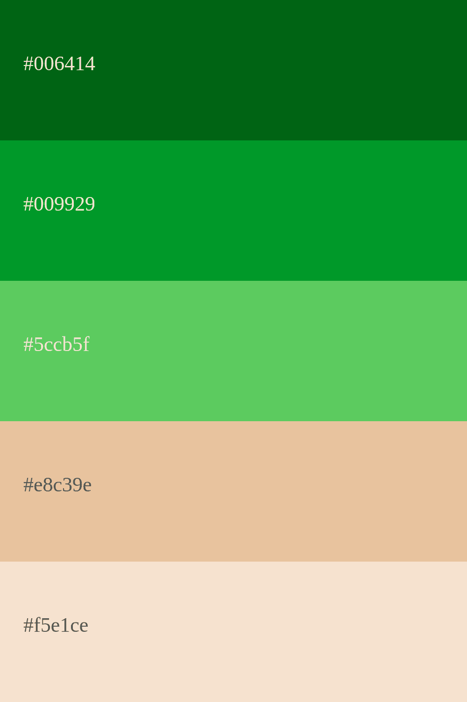
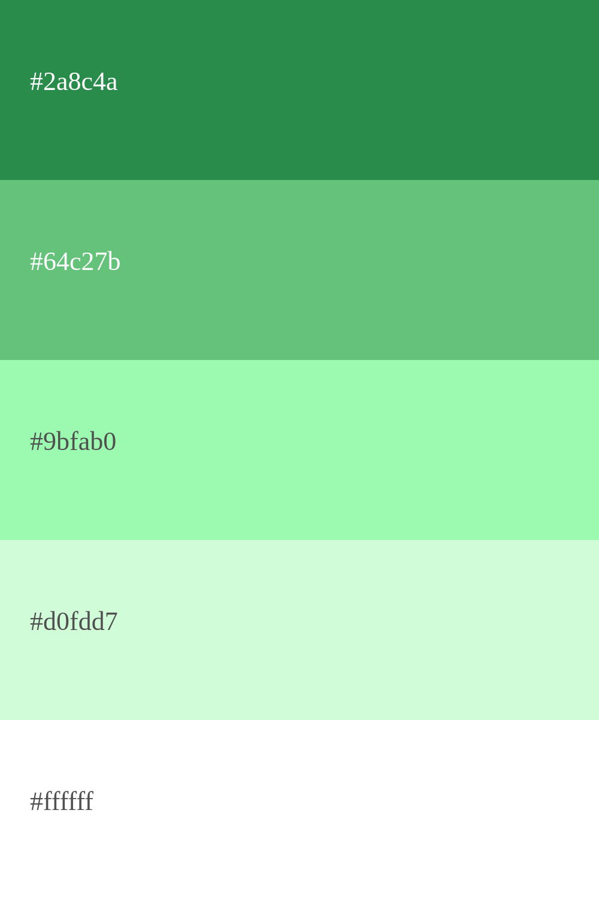

# 
 🟩 Validação do Cartão de Crédito - SAÚDE VALIM 🟩 

###  
 Acesse o projeto completo [CLICANDO AQUI](https://vanessanmenezes.github.io/Card-validation/) 

***

## Resumo do projeto

Neste projeto, foi criado um aplicativo da Web que permita ao usuário 
validar o número de um cartão de crédito, com a implementação da funcionalidade 
para ocultar todos os dígitos de um cartão, exceto os quatro últimos.
Nele, fui desafiada a criar uma interface que deve permitir ao usuário: 

* Inserir o número que deseja validar, utilizando apenas caracteres
  numéricos (dígitos) no cartão para validar [0-9].
* Constatar se o resultado é válido ou não.
* Ocultar todos os dígitos do número do cartão, exceto os últimos 4
  caracteres.
* Não deve poder inserir um campo vazio.

## E como esta validação do cartão de crédito é feita?

Atráves do **Algoritmo de Luhn**, também conhecido como “Algoritmo do Módulo 10”,
é uma fórmula  de soma de verificação simples, usada para determinar se o número 
de identificação do cartão de crédito fornecido por um usuário é válido. 

***

## DEFINIÇÃO DO PRODUTO

O aplicativo web de validação do cartão de crédito **SAÚDE VALIM**, foi planejada com 
o intuito de fornecer uma página simples e intuitiva (inclusive para facilitar
o acesso das pessoas 60+, uma vez que se trata de um benefício para a saúde), 
direcionada ao público que já possui este cartão e deseja apenas validá-lo
para ser utilizado em serviços de saúde. De maneira compreensível e descomplicada,
é solicitado apenas que o usuário preencha 3 dados: nome completo, número do
cartão e a data de validade. Logo em seguida, o mesmo recebe uma mensagem simples,
confirmando a validação do cartão ou de erro (caso o número esteja incorreto). E,
se o campo do número do cartão estiver vazio, é solicitado que o mesmo preencha.

## Nível de EXPERIÊNCIA e INTERFACE 

A interface do usuário (UI), ou seja, a parte visual desse projeto, foi pensada
com base na empresa fictícia **SAÚDE VALIM**. Atráves da psicologia das cores, foi
escolhida a cor verde, que representa tanto saúde, vitalidade e cura, quanto dinheiro.
Como estamos falando de um cartão de crédito para serviços de saúde, esta cor foi 
definida. Sendo assim, duas paletas foram selecionadas (imagens abaixo) para estabelecer
a comunicação visual entre usuário e marca (SAÚDE VALIM), fortalecendo a identidade 
visual dessa plataforma e tornando-a reconhecível.

  

Tanto a interface, quanto a experiência do usuário, foram pensadas e baseadas
atráves de um protótipo construído no figma (imagem abaixo). A experiência do 
usuário (UX), foi de forma geral estabelecida de maneira fácil, compreensível,
simples, intuitiva e até mesmo interessante de ser utilizada pelo público-alvo.

***

### 🟩 ESTE PROJETO FOI CRIADO E DESENVOLVIDO POR: [VANESSA MENEZES](https://github.com/VanessaNMenezes) 💚

***
